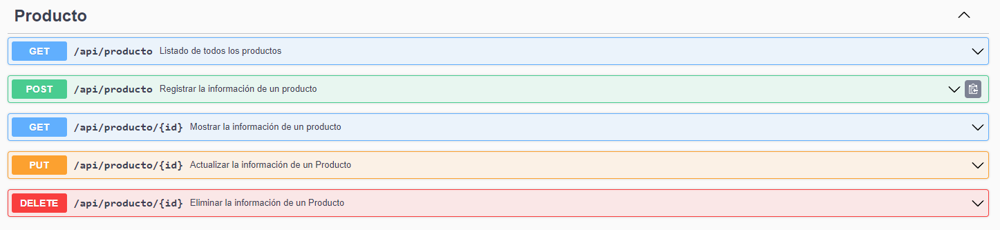

# Proyecto Bodega Bouffanais Company

Acceso mediante URL Hosting
--
*Proximamente*

Instalacion del programa de forma local
--
### Programas necesarios

- Visual Studio Code
- Xampp (Php y MySql)
- Composer
- Node js
- Git

### Orden instalacion programas
1. Instalar Xampp
2. Instalar Composer y adjuntar ruta php (C:\xampp\php)
3. Instalar Node js
4. Instalar Git

### Clonacion del proyecto
Nos dirimos a la siguiente ruta (C:\xampp\htdocs) y abrimos el cmd desde esa misma ruta y clonamos el proyecto.

`git clone https://github.com/luxcho1/proyectoMusicPro.git`

### Instalacion componentes basicos

En el mismo cmd ejecutamos `cd proyectoMusicPro`  para ubicarnos en la carpeta del proyecto y ejecutamos los siguientes scripts.

`composer install`

`npm install`

`php artisan storage:link`

### Crear el archivo .env
Luego escribimos `code .` para acceder al proyecto desde Visual Studio Code y en la terminal de este ejecutamos el siguiente script.

`cp .env.example .env`

### Configurar base de datos
Abrimos el archivo .env y escribimos musicpro donde dice DB_DATABASE

> Crear base de datos llamada "musicpro" en phpmyadmin

### Hacer migracion con base de datos
`php artisan migrate:fresh --seed`

### Generar un clave
`php artisan key:generate`

### Ejecutar programa
`php artisan serve`

Endpoint Swagger
--

http://127.0.0.1:8000/api/documentation

Hacer testing de carga
--
Dentro del proyecto ubicarse en la siguiente ruta (proyectoMusicPro\database\seeders) y abrir el archivo ProductoTableData.php.

Luego simplemente donde dice range(1,10) indicar el número de datos que desee probar y ejecutar el siguiente script.

`php artisan db:seed`

Licencia
--
Este software es de codigo abierto y cualquiera puede modificarlo